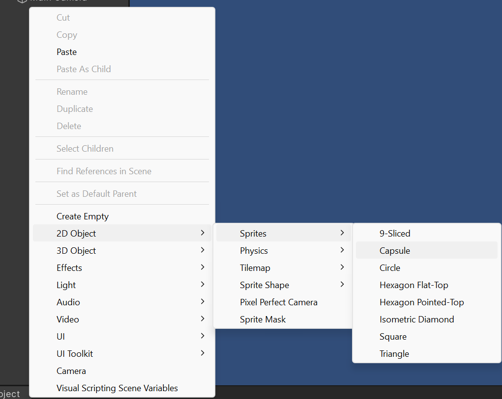
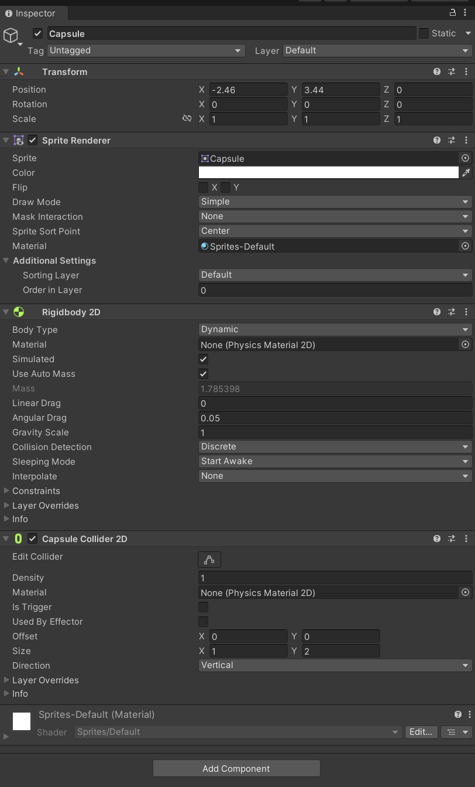
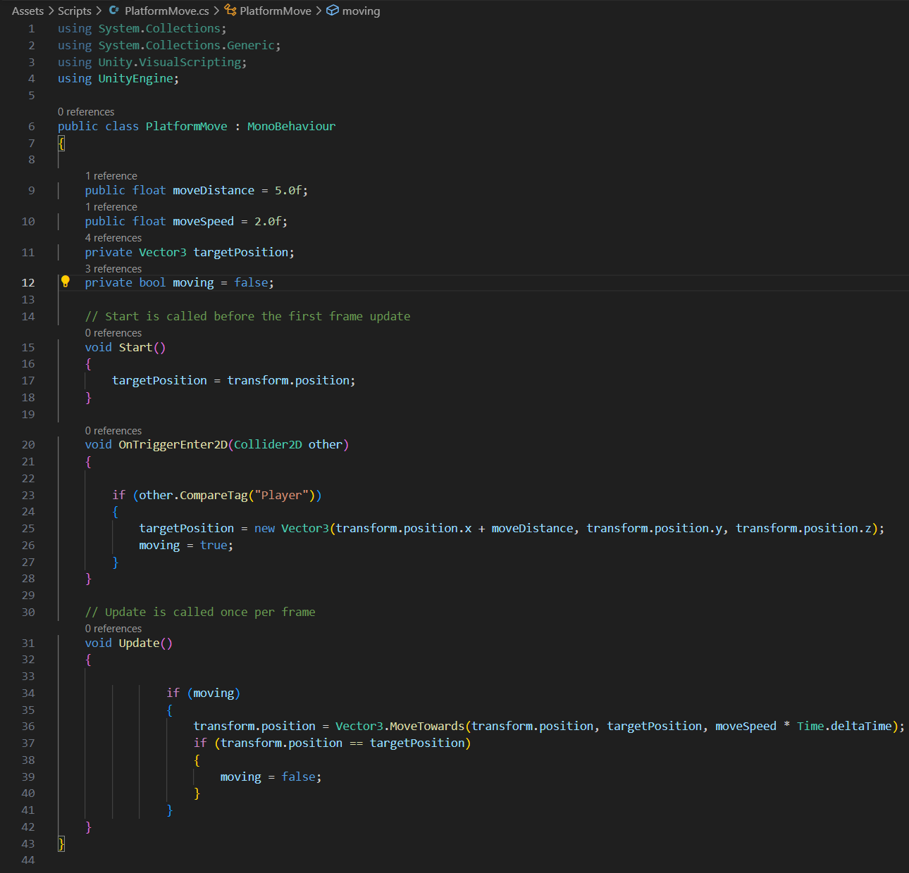

# How to make a seesaw platform.

Today we are going to make a seesaw platform within unity 2D, the version I will be using for this is 2022.3.46f1.

First off you want to make an object that you can use as a player, I will use a capsule for this.
You can find them by right clicking on the hierarchy and then going to 2D object, then sprites, then clicking on capsule.

Now that we have our capsule we need to add some components to it, first we want to add a rigid body 2D to it and a capsule collider 2D so that it can interact with other objects. Your capsule in the inspector should now look like this. You can use auto mass to automatically set the weight of your object depending on its size.

Now we need something to act as our platform, I'm going to go back to the 2D objects as seen before and choose square this time. Once that's done you can scale it to the length of the platform you want and then make sure to add a rigid body 2D and box collider 2D, so that it can interact with other objects as well.

The rigid body 2D's we added means that they can interact with colliders, while the capsule collider and box collider means that they can interact with the rigid body 2D's. By doing this we have given both objects the ability to interact with each other.

The final part of this tutorial is to add a hinge joint 2D component to your Platform, and then you want to enable 'Use Motor' and then 'Use Limits'. If you set the motor speed and maximum motor force to 1 you can then use the angle limits below to set your angle limits for the amount of tilt, you want to have each way. The lower angle represents how far left and the upper angle represents how far right it can go. 

This method requires no scripting as it uses the gravity used by unity to make the platform tilt depending on where the player is.

# Making it move
Now we are going to add movement to our platform when an object with the player tag collides with it. All of it will be code based this time. 

The first thing we need to do make our variables for the distance we want our platform to move as well as the speed and target position of the platform.

 The first two of these as seen below will be set to public variables, you could also use [SerializeField] if you'd rather not have it accessible to every script you use, i have set it to a public variable here. 
 
 As for the target position we want it private as it doesnt need to be accessed by anything else.  After that we want to set the targetPosition variable up on launch. For this we will just say that the targetPostion is the trasnform.position. After that we have a boolean for if the platform is moving

 After this we can then move on the OnTriggerEnter2D method seen below. The 2D at the end is what set it apart from the regular one which is used in 3D scenes, since we are using 2D colliders you need the 2D. 
 
 Inside this we are going to use an if statment, this statment will be used to check if anything touching it has the tag of "Player". If it does then it changes the targetPosition variable to where you decide it to be within unity (I will show this later!) we then set moving to true.

 After that we move into the void Update() method where we add a new if, this if statement checks to see if moving is set to true, if it is then it will change the transform.position of the object its attached to. It will then move towards the targetPosition and = at the specified speed set in unity, ensure you multiply the moveSpeed by Time.deltaTime to ensure that the speed is regulated. If you do forget this then the speed will be framerate dependant, as such a higher peforming computer will have a faster moving platform than a lower peforming computer. You should aim to have the same experience on both high and low peforming devices.

 The final part is adding another if statement inside the one we just made which checks if the current position is equal to the targetPosition variable and sets moving to false. 
 
 If you wish to have the platform move up or down instead of across you can change the code in the compareTag if statment, to do this you would go and move the "+ moveDistance" from after transform.position.x to after transform.position.y so that it moves vertically instead.
